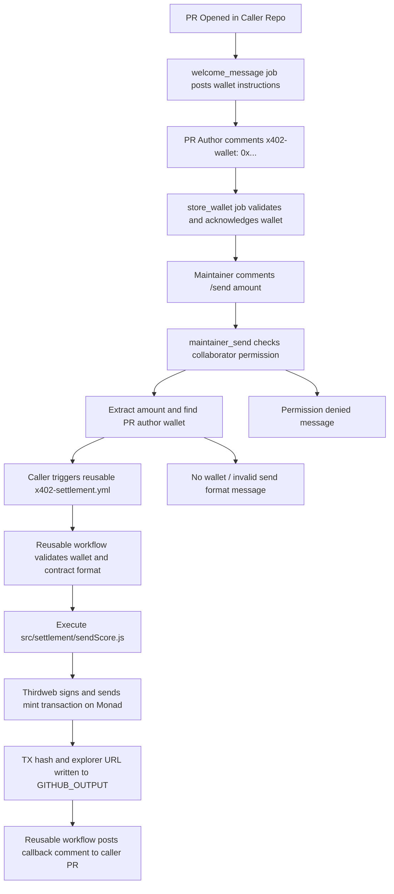

# MVP Overview: x402 Cross-Repo Settlement System

This document provides a single end-to-end overview of the two-repository x402 workflow:

- Caller repository (client-facing PR workflow): [kpj2006/caller-repo-template](https://github.com/kpj2006/caller-repo-template.git)
- Reusable settlement engine repository: [manashatwar/x402_workflow](https://github.com/manashatwar/x402_workflow.git)

It is based on current workflow files and settlement source code in this repository.

## 1. System Purpose

The system rewards pull request contributors by minting non-transferable SCORE tokens on Monad after maintainer approval.

- Caller repo handles GitHub PR interaction and approval command flow.
- Reusable repo handles blockchain settlement and callback reporting.

## 2. Repository Roles

### Caller Repository (kpj2006/caller-repo-template)

Primary file:

- .github/workflows/pr-x402-trigger.yml

Responsibilities:

- Post welcome message when PR opens.
- Accept and validate contributor wallet comments in the format `x402-wallet: 0x...`.
- Accept maintainer `/send <amount>` command.
- Check maintainer permissions (`admin` or `write`).
- Extract amount and locate PR author wallet.
- Call reusable workflow with normalized inputs.
- Show user-facing error/status messages for invalid command or missing wallet.

### Reusable Repository (manashatwar/x402_workflow)

Primary files:

- .github/workflows/x402-settlement.yml
- .github/workflows/x402-settlement-demo.yml
- src/settlement/sendScore.js

Responsibilities:

- Validate settlement inputs and addresses.
- Load network configuration for `monad-testnet` or `monad-mainnet`.
- Execute mint transaction via Thirdweb + wallet account.
- Emit `TX_HASH` and `EXPLORER_URL` outputs.
- Post success/failure callback comment to caller repository using callback token.

## 3. End-to-End Flow

## 4. Workflow Interface Contract

### Caller -> Reusable Inputs

Sent by caller `trigger_settlement` job:

- `repo_name`: caller repository (owner/repo)
- `issue_number`: PR number
- `recipient_wallet`: extracted PR author wallet
- `score_amount`: parsed from `/send <amount>`
- `network`: currently `monad-testnet` in caller template

### Required Secrets for Reusable Workflow

Defined in `.github/workflows/x402-settlement.yml`:

- `THIRDWEB_SECRET_KEY`
- `SERVER_WALLET`
- `SCORE_TOKEN_CONTRACT`
- `RPC_URL`
- `CALLBACK_GITHUB_TOKEN`

In caller template mapping, these are provided from caller secrets:

- `X402_SERVER_WALLET` -> `SERVER_WALLET`
- `X402_SCORE_TOKEN_CONTRACT` -> `SCORE_TOKEN_CONTRACT`
- `X402_RPC_URL` -> `RPC_URL`
- `X402_WORKFLOW_TOKEN` -> `CALLBACK_GITHUB_TOKEN`

## 5. Runtime Components

### GitHub Actions Layer

- Event processing and command orchestration
- Permission checks and guard rails
- Cross-repo workflow dispatch
- Callback comment publishing

### Settlement Engine Layer

`src/settlement/sendScore.js` performs:

- Required env validation
- Address validation with `ethers.isAddress`
- Network selection (`monad-testnet` or `monad-mainnet`)
- Mint transaction preparation
- Transaction broadcast + hash capture
- Explorer URL construction

### Blockchain Layer

- Monad network RPC endpoint
- SCORE token contract `mint(address,uint256)` call
- On-chain transaction confirmation via tx hash

## 6. Failure/Guard Paths

Caller-side guard paths:

- Non-maintainer `/send` -> permission denied comment
- Invalid `/send` format -> usage hint comment
- Missing PR author wallet -> wallet required comment

Reusable-side guard paths:

- Invalid input addresses -> workflow fail
- Missing required env/secrets -> workflow fail
- Transaction error -> failure callback comment

## 7. Operational Notes

- The two repositories are independent deploy units and should reference each other via GitHub URLs, not local relative paths.
- The caller template is designed for client adoption in separate repositories.
- `x402-settlement-demo.yml` is useful for manual smoke tests before wiring caller automation.

## 8. Key Files to Review

Caller repo (template):

- `.github/workflows/pr-x402-trigger.yml`
- `docs/QUICKSTART.md`
- `docs/MAINTAINER_GUIDE.md`

Reusable repo (this repo):

- `.github/workflows/x402-settlement.yml`
- `.github/workflows/x402-settlement-demo.yml`
- `src/settlement/sendScore.js`
- `docs/ARCHITECTURE.md`
- `docs/WORKFLOWS.md`
