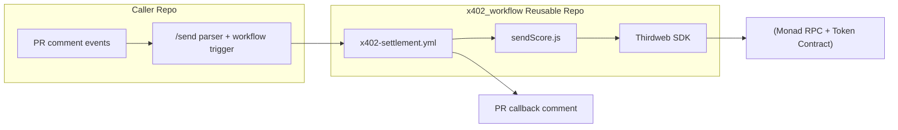
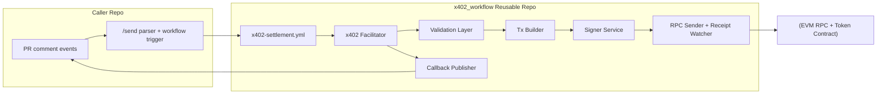
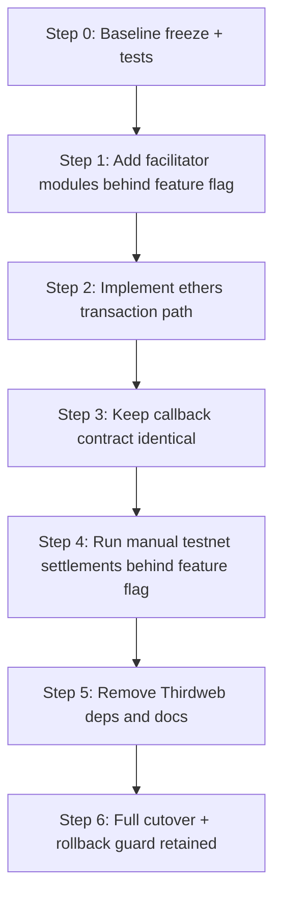
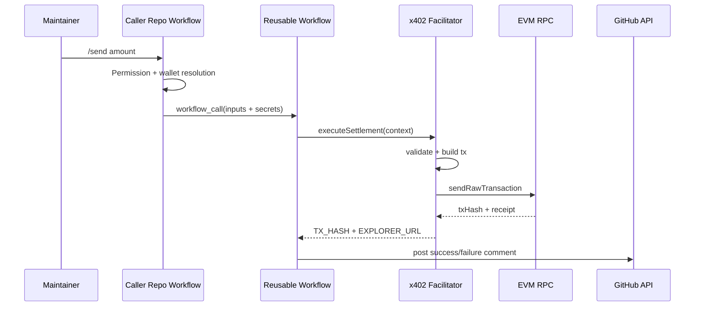

# Phase 2 Architecture Shift Plan

This document explains how Phase 2 will shift the current settlement architecture from Thirdweb-based execution to a fully self-managed x402 execution stack.

Related roadmap phase:

- [roadmap.md](roadmap.md)

## 1. Why This Shift

Phase 2 is not only a dependency swap. It is an ownership shift.

Target outcome:

- We control transaction building, signing flow, policy checks, and execution lifecycle.
- No Thirdweb in runtime, docs, secrets, or setup guidance.
- Existing caller experience and callback contract remain stable.

## 2. Scope and Guardrails

In scope:

- Replace Thirdweb execution path with ethers.js JSON-RPC transaction path.
- Introduce internal x402 facilitator module for execution orchestration.
- Keep caller command model and callback comment behavior unchanged.

Out of scope:

- Treasury model (Phase 3).
- Chain-agnostic multi-chain routing (Phase 4).
- CLI/action productization (Phase 5).

## 3. Current vs Target Architecture

### 3.1 Current (Before Phase 2)

### 3.2 Target (After Phase 2)

## 4. x402 Facilitator Design

The facilitator is the internal execution coordinator introduced in Phase 2.

Core responsibilities:

- Normalize and validate runtime inputs.
- Resolve chain + contract execution context.
- Build contract call payload with ethers Interface.
- Sign and submit transaction with private key wallet.
- Wait for confirmation and emit deterministic outputs.
- Publish callback result payload consumed by workflow comment step.

Suggested internal modules:

- `facilitator/context.js`: env and input normalization.
- `facilitator/validate.js`: address, amount, network guards.
- `facilitator/tx-builder.js`: ABI encode mint call.
- `facilitator/executor.js`: send/wait/retry with ethers provider.
- `facilitator/result.js`: `TX_HASH`, `EXPLORER_URL`, error classification.

Note: this aligns with the current JavaScript codebase. If TypeScript is adopted later, do it as a separate planned migration with build/tooling updates.

## 5. Workflow Contract Compatibility

The following must remain compatible during Phase 2:

- Caller workflow inputs to reusable workflow.
- Callback comment format (success and failure semantics).
- `TX_HASH` and `EXPLORER_URL` output keys.

This allows caller repos to migrate without behavior changes.

## 6. Secrets and Setup Changes

### 6.1 Remove

- Thirdweb secret references from workflows and docs.
- Thirdweb package dependencies from `package.json`.

### 6.2 Keep

- `SERVER_WALLET`
- `SCORE_TOKEN_CONTRACT`
- `RPC_URL`
- callback GitHub token secret

### 6.3 Wallet Generation Guidance

Only these methods should appear in docs:

- `cast wallet new`
- ethers.js one-liner
- browser wallet

No Thirdweb mention for wallet creation.

## 7. Migration Plan (How the Shift Occurs)

Detailed steps:

1. Baseline freeze

- Lock current behavior with golden integration tests.
- Capture expected comment payloads and output keys.

1. Parallel implementation

- Add facilitator path while retaining old path behind flag.
- Use explicit GitHub Actions control, for example workflow input or env variable:
  - `USE_FACILITATOR: true|false`
- Route settlement execution path using this value until full cutover.
- Validate output parity between both implementations.

1. Canary rollout

- Run 5 to 10 manual testnet settlements with `USE_FACILITATOR=true` before full cutover.
- Compare success rates, latency, and error classes.

1. Dependency removal

- Remove Thirdweb imports and packages.
- Remove Thirdweb docs and secret references.

1. Full cutover

- Set facilitator path as default.
- Keep temporary rollback flag for one release window.

## 8. Runtime Sequence (Target)

## 9. Risks and Mitigations

Risk: nonce collisions under concurrent runs.

- Mitigation: fetch `pending` nonce at sign time and rely on chain-level nonce rules to reject replay/conflicts; avoid any external queue/server dependency.

Risk: RPC instability.

- Mitigation: retry policy, alternate RPC endpoint support, classified errors.

Risk: behavior drift in callback comments.

- Mitigation: snapshot tests for markdown payloads.

Risk: hidden Thirdweb references left in docs.

- Mitigation: CI lint check for forbidden keywords.

## 10. Definition of Done

Phase 2 is complete only when all are true:

- No Thirdweb dependency in source or package manifests.
- No Thirdweb mention in setup and wallet-generation docs.
- Testnet end-to-end runs pass with ethers-only path.
- Callback output contract unchanged for caller repos.
- Rollback plan documented and tested once.

## 11. Immediate Implementation Backlog

- Create facilitator module skeleton and interfaces.
- Refactor `src/settlement/sendScore.js` to delegate to facilitator.
- Replace Thirdweb calls with ethers provider/wallet/contract call.
- Add parity tests for success and failure callback payloads.
- Update docs and secrets sections across reusable and caller template docs.
