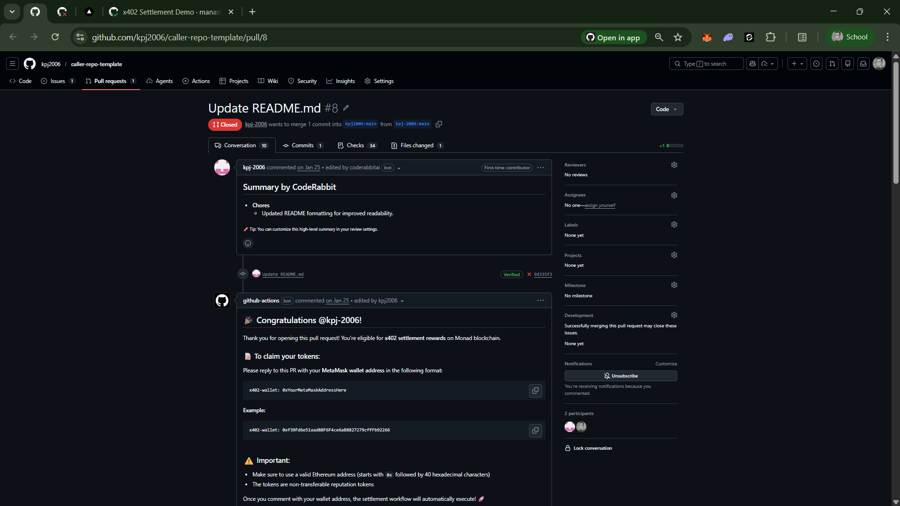
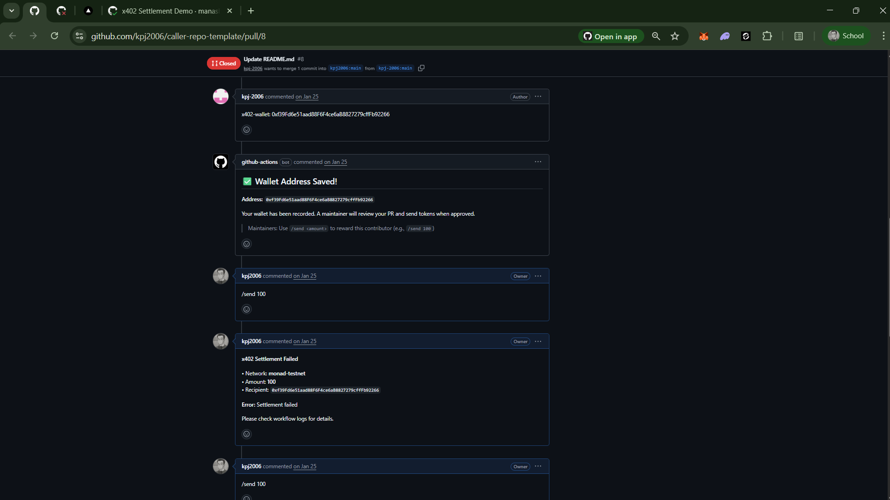
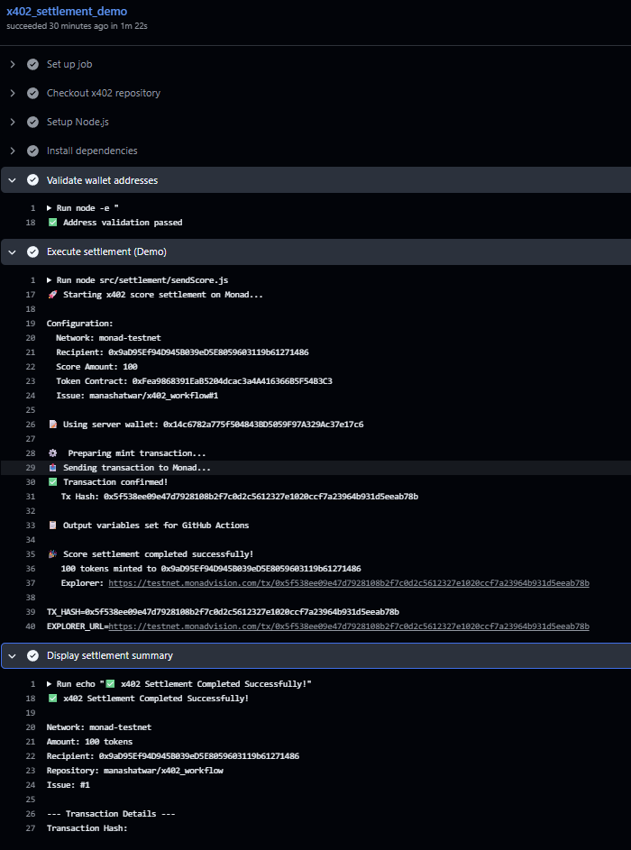
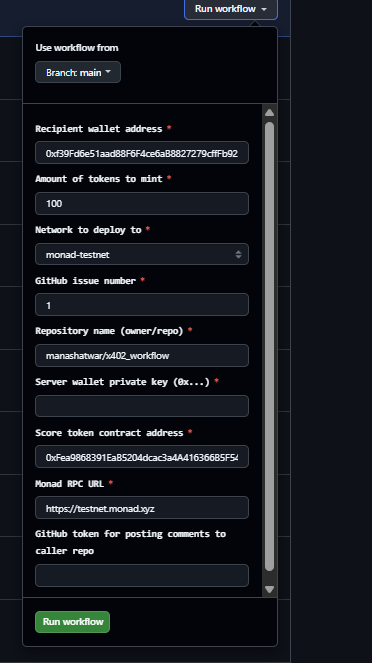

# x402 Workflow Roadmap

This roadmap defines the evolution path for the x402 settlement system across caller and reusable repos.

Current baseline:

- Cross-repo PR-triggered settlement is working.
- Caller workflow handles wallet collection and maintainer trigger.
- Reusable workflow executes on-chain settlement and callback comments.

## Pre-Phase 1 PoC Evidence (What Already Works)

These artifacts show the system behavior before formal Phase 1 hardening begins.

Primary evidence links:

- Demo video: https://www.youtube.com/watch?v=T2r8UPdkb18 (in demo run by workflow_dispatch, but flow is the same as PR-triggered)
- Caller PR flow example: https://github.com/kpj2006/caller-repo-template/pull/8
- Reusable workflow run example: https://github.com/manashatwar/x402_workflow/actions/runs/23678237350

Local screenshots used for this PoC snapshot:

- 
- 
- 
- 

What this PoC demonstrates before Phase 1:

- Contributor claim capture works in PR comments:
  - Bot asks for `x402-wallet: 0x...` format.
  - User posts wallet comment and workflow acknowledges with "Wallet Address Saved".
- Maintainer trigger model works:
  - Maintainer uses `/send 100` style command in PR discussion.
- Callback contract behavior already exists:
  - Failure callback format is posted to PR with network, amount, recipient, and error summary.
  - This validates the feedback loop from reusable workflow back to caller PR.
- On-chain execution path is confirmed in demo run logs:
  - Address validation step passes.
  - Settlement step logs tx preparation, send, and confirmation.
  - Tx hash and explorer URL are emitted as workflow outputs.
  - Summary step prints normalized settlement details.
- Manual settlement run path works as well:
  - `workflow_dispatch` form accepts recipient, amount, network, issue/repo context, wallet key, contract, RPC URL, and callback token.


## Phase 1: Stability and Hardening

Goal:

- Make the current system production-stable before feature expansion.

Scope:

- Workflow reliability, retries, idempotency, and error messages.
- Better observability (run metadata, structured logs, failure classification).
- Security review of tokens/secrets and permission boundaries.
- Regression tests for: wallet parsing, maintainer permission checks, callback posting.

Deliverables:

- Stability checklist and runbook.
- Integration test matrix for caller + reusable workflows.
- Standardized incident triage guide.

Exit criteria:

- Success rate target met over rolling runs.
- Known failure types documented with resolution steps.
- No critical security findings open.

## Phase 2: Remove Thirdweb Dependency

Goal:

- Remove Thirdweb completely from settlement execution.

Required direction:

- Thirdweb is not used or mentioned for wallet generation.
- Setup guidance only uses:

  - `cast wallet new`
  - ethers.js one-liner
  - browser wallet

Scope:

- Replace Thirdweb transaction path in settlement engine with direct ethers.js JSON-RPC flow.
- Update docs, examples, and workflow secrets to remove Thirdweb references.
- Keep existing behavior and callback contract unchanged.

Deliverables:

- Refactored settlement script without Thirdweb imports.
- Updated docs and workflow interfaces.
- Migration note for existing users.

Exit criteria:

- Thirdweb dependency removed from `package.json` and source.
- End-to-end settlement works on testnet with ethers.js only.

**read in details in [phase2_architecture_shift.md](phase2_architecture_shift.md) for the technical approach and migration plan.**

## Phase 3: Treasury Contract Model (Pre-Funded Pool)

Goal:

- Move from mint-on-demand to treasury-based token distribution.

Scope:

- Introduce treasury contract funded in advance.
- CI/CD distributes from treasury pool instead of calling mint each time.
- Add safeguards: balance checks, allowance checks, and payout limits.

Deliverables:

- Treasury contract specification and deployment guide.
- Reusable workflow updated for transfer/disbursement mode.
- Emergency pause and treasury refill SOP.

Exit criteria:

- Settlements execute without mint role dependency.
- Treasury accounting and audit trail are verifiable.

## Phase 4: Chain-Agnostic and Multi-Token

Goal:

- Support any EVM chain and multiple token contracts.

Scope:

- Chain-agnostic config via workflow inputs (RPC, chainId, explorer, symbol).
- Multi-token support by repo, label, or contribution type.
- Validation layer for chain/token compatibility.

Deliverables:

- Unified chain config schema.
- Token routing policy map.
- Backward-compatible defaults for current Monad flows.

Exit criteria:

- Same reusable workflow runs on multiple EVM networks.
- Multiple token payouts supported in one org setup.

## Phase 5: x402 CI/CD Reusable Action + CLI + Chat UX

Goal:

- Provide a first-class reusable automation interface.

Scope:

- Publish reusable action style interface.
- Introduce CLI command:

```bash
x402 pay --to wallet 0x... --amount 100 --chain monad
```

- Support GitHub comment/chat command style:

```text
/send 0x... 10usdc monad
```

- Keep simple action usage in workflows:

```yaml
- uses: x402/pay@v1
  with:
    recipient: ${{ steps.wallet.outputs.addr }}
    score_amount: ${{ fromJSON(needs.maintainer_send.outputs.score_amount) }}
    network: monad-testnet
  secrets: inherit
```

Deliverables:

- `x402/pay@v1` reusable action/reusable workflow contract.
- CLI package and command docs.
- Command parser spec for GitHub comments.

Exit criteria:

- Teams can integrate payouts with one action step.
- CLI and comment command both resolve to the same payout engine.

## Phase 6: Policy Engine

Goal:

- Add declarative payment rules controlled by admins.

Scope:

- Policy gates such as:

  - tests passed
  - PR merged
  - maintainer approved
  - coverage > 80%

Example direction:

```yaml
- uses: x402/pay@v1/test-passed
  needs: test
  with:
    recipient: ${{ steps.wallet.outputs.addr }}
    score_amount: ${{ fromJSON(needs.maintainer_send.outputs.score_amount) }}
    network: monad-testnet
  secrets: inherit
```

Deliverables:

- Policy DSL/schema.
- Policy evaluator in workflow runtime.
- Admin docs for rule management and overrides.

Exit criteria:

- Payouts are blocked unless policies pass.
- Policy decisions are visible in logs/comments.

## Phase 7: Multi-Contributor and Split Payouts

Goal:

- Support multiple recipients and different amounts in one PR context.

Scope:

- Parse and execute multiple `/send` lines safely.
- Recipient-explicit command support.
- Batch settlement with partial-failure reporting.

Example target usage:

```text
@alice /send 0x... 30 usdc monad
@bob /send 0x... 40 usdc monad
@charlie /send 0x... 50 usdc monad
```

Deliverables:

- Multi-recipient parser and validator.
- Batch payout execution strategy.
- Clear PR comment summary per recipient.

Exit criteria:

- One maintainer action can settle multiple contributors.
- Failures do not hide successful payouts.

## Phase 8: Web2 Settlement + Reputation Dashboard

Goal:

- Expand beyond crypto-native contributors and improve visibility.

Scope:

- Web2 settlement/offramp via x402 HTTP payments for non-crypto users.
- Reputation dashboard reading on-chain scores and showing org-level contributor views.

Deliverables:

- Offramp integration architecture.
- Contributor identity mapping model.
- Dashboard service and UI MVP.

Exit criteria:

- Non-wallet contributors can receive value through Web2 rails.
- Org can view contributor score trends and payout history.

## Cross-Phase Program Requirements

- Backward compatibility for existing caller repos where possible.
- Security review before each major phase rollout.
- Versioned migration guides for workflow/action interface changes.
- Feature flags for controlled rollout and rollback.

## some important links (must read for better understanding of the context and security implications)
- important article:[link](https://chainscorelabs.com/en/guides/developer-experience-dx-blockchain-tools-and-analytics/smart-contract-lifecycle/how-to-establish-a-secure-smart-contract-deployment-pipeline)
- for upto-date about x402: https://github.com/xpaysh/awesome-x402
- some important links for this : [link](links.md)
- x402 deep dive: https://www.youtube.com/live/lSdHKTmLArY?si=30I_K015jj8Ho529
- after all phase, security review for trust and safety: https://youtube.com/playlist?list=PL5d8mp75BVkTLJg1hfThfB7cHLVnfYjzZ&si=QFtvyRpRpOpuXdfE
