# xops Workflow Roadmap

This roadmap defines the evolution path for the xops CI/CD execution engine across caller and reusable repos.

## System Architecture

xops is a **stateless CI/CD execution engine** that orchestrates token transfers triggered by repository events. It does not:
- deploy or manage smart contracts
- custody or control user funds
- own or select blockchain networks

The client (organization using xops) is responsible for:
- deploying and owning all smart contracts (token, treasury)
- providing RPC endpoints and chain configuration
- managing the operator wallet (private key)
- funding any treasury contract

## Security Adoption Modes (Backward Compatible)

The execution engine supports two client-selected modes:

1. Direct transfer mode (compatibility mode)
- Client provides token contract and operator wallet.
- Engine executes direct token transfer call.
- Useful for low-value, test, or PoC environments.

2. Treasury disbursement mode (recommended for production)
- Client deploys and funds treasury contract.
- Engine executes treasury `disburse(recipient, amount)` call.
- Contract-level controls can enforce limits, pause, and operator permissions.

This design enables progressive security adoption without forcing contract migration.

## Trust Boundary: GitHub Layer vs Contract Layer

Repository governance and fund governance are separate by design:

- GitHub layer controls **who can trigger** execution:
  - branch protection
  - required checks/reviews
  - maintainer command permissions

- Contract layer controls **what execution is allowed**:
  - payout limits
  - pause/stop controls
  - operator authorization

The engine coordinates both layers but does not merge their responsibilities.

Current baseline:

- Client-repo PR-triggered execution is working.
- Caller workflow handles wallet collection and maintainer trigger.
- Reusable execution engine processes on-chain transactions and callback reporting.
- All infrastructure (contracts, RPC, wallet) is client-provided and client-owned.

## Pre-Phase 1 PoC Evidence (What Already Works)

These artifacts show the system behavior before formal Phase 1 hardening begins.

Primary evidence links:

- Demo video: https://www.youtube.com/watch?v=T2r8UPdkb18 (in demo run by workflow_dispatch, but flow is the same as PR-triggered)
- Caller PR flow example: https://github.com/kpj2006/caller-repo-template/pull/8
- Reusable workflow run example: https://github.com/manashatwar/x402_workflow/actions/runs/23678237350

Local screenshots used for this PoC snapshot:

- 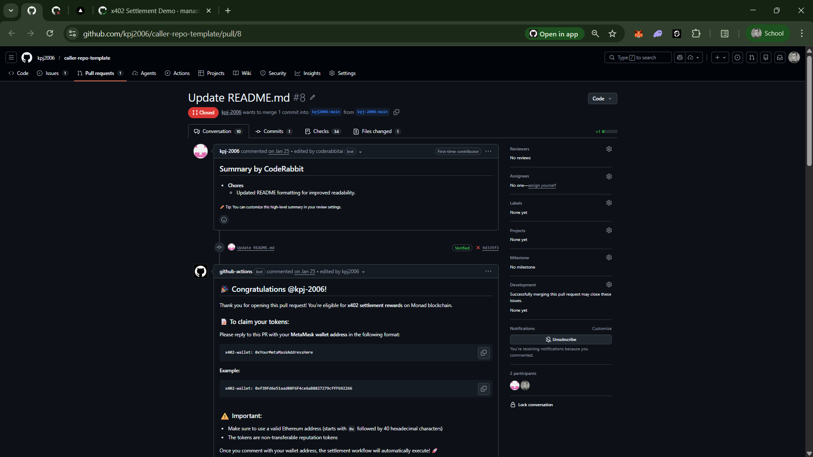
- 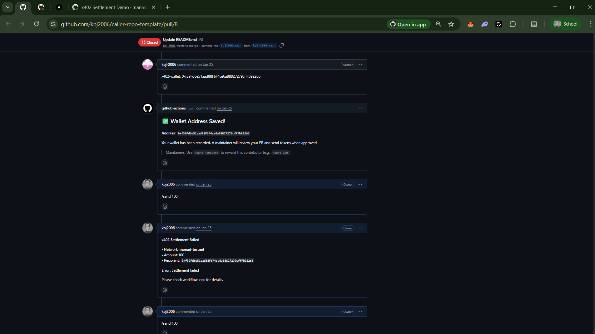
- 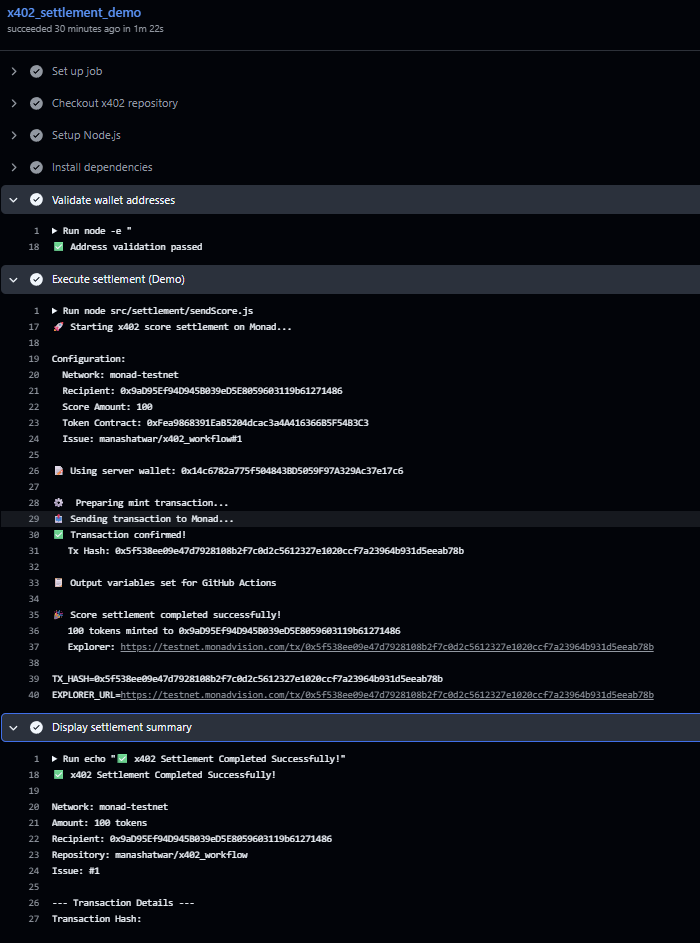
- 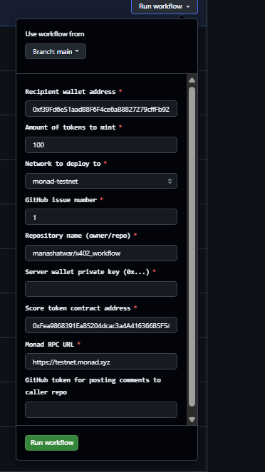

What this PoC demonstrates before Phase 1:

- Contributor claim capture works in PR comments:
  - Bot asks for `x402-wallet: 0x...` format.
  - User posts wallet comment and workflow acknowledges with "Wallet Address Saved".
- Maintainer trigger model works:
  - Maintainer uses `/send 100` style command in PR discussion.
- Callback contract behavior already exists:
  - Failure callback format is posted to PR with network, amount, recipient, and error summary.
  - This validates the feedback loop from reusable workflow back to caller PR.
- On-chain execution path is confirmed in demo run logs:
  - Address validation step passes.
  - Settlement step logs tx preparation, send, and confirmation.
  - Tx hash and explorer URL are emitted as workflow outputs.
  - Summary step prints normalized settlement details.
- Manual settlement run path works as well:
  - `workflow_dispatch` form accepts recipient, amount, network, issue/repo context, wallet key, contract, RPC URL, and callback token.

## Phase 1: Execution Hardening and Dependency Ownership

Goal:

- Establish a production-ready execution engine by combining reliability hardening with full ownership of the transaction execution path.
- Remove external dependencies while ensuring deterministic, observable, and secure CI/CD-driven settlement.

Scope:

- Workflow reliability, retries, idempotency, and clear error handling.
- Structured observability (run metadata, logs, failure classification).
- Security review of secrets, permissions, and execution boundaries.
- Regression testing for:
  - wallet parsing
  - maintainer permission validation
  - callback contract behavior
- Replace Thirdweb execution with direct ethers.js JSON-RPC interaction.
- Remove all Thirdweb references from code, docs, and setup flows.
- Maintain backward compatibility with existing workflow inputs and outputs.

### Internal Flow: End-to-End Settlement Pipeline

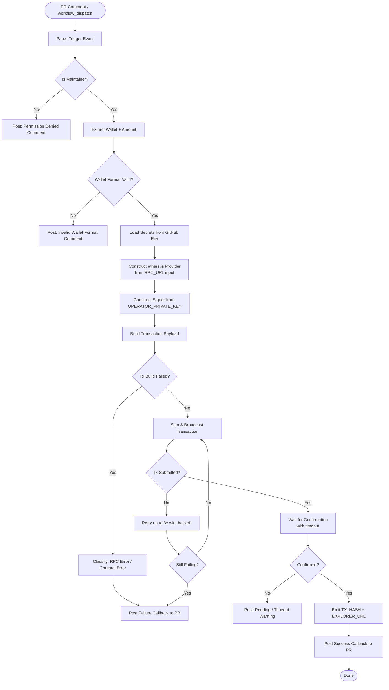
```mermaid
flowchart TD
  A([PR Comment / workflow_dispatch]) --> B[Parse Trigger Event]
  B --> C{Is Maintainer?}
  C -- No --> D[Post: Permission Denied Comment]
  C -- Yes --> E[Extract Wallet + Amount]
  E --> F{Wallet Format Valid?}
  F -- No --> G[Post: Invalid Wallet Format Comment]
  F -- Yes --> H[Load Secrets from GitHub Env]
  H --> I[Construct ethers.js Provider\nfrom RPC_URL input]
  I --> J[Construct Signer from OPERATOR_PRIVATE_KEY]
  J --> K[Build Transaction Payload]
  K --> L{Tx Build Failed?}
  L -- Yes --> M[Classify: RPC Error / Contract Error]
  M --> N[Post Failure Callback to PR]
  L -- No --> O[Sign & Broadcast Transaction]
  O --> P{Tx Submitted?}
  P -- No --> Q[Retry up to 3x with backoff]
  Q --> R{Still Failing?}
  R -- Yes --> N
  R -- No --> O
  P -- Yes --> S[Wait for Confirmation\nwith timeout]
  S --> T{Confirmed?}
  T -- No --> U[Post: Pending / Timeout Warning]
  T -- Yes --> V[Emit TX_HASH + EXPLORER_URL]
  V --> W[Post Success Callback to PR]
  W --> X([Done])
```

### Internal: Retry and Idempotency Pattern

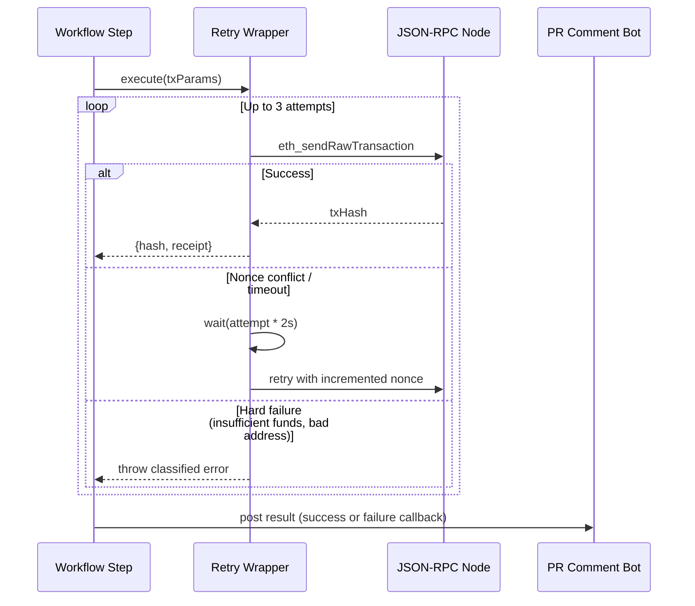
```mermaid
sequenceDiagram
  participant W as Workflow Step
  participant R as Retry Wrapper
  participant RPC as JSON-RPC Node
  participant PR as PR Comment Bot

  W->>R: execute(txParams)
  loop Up to 3 attempts
    R->>RPC: eth_sendRawTransaction
    alt Success
      RPC-->>R: txHash
      R-->>W: {hash, receipt}
    else Nonce conflict / timeout
      R->>R: wait(attempt * 2s)
      R->>RPC: retry with incremented nonce
    else Hard failure (insufficient funds, bad address)
      R-->>W: throw classified error
    end
  end
  W->>PR: post result (success or failure callback)
```

### Internal: Secret and Permission Boundary Map

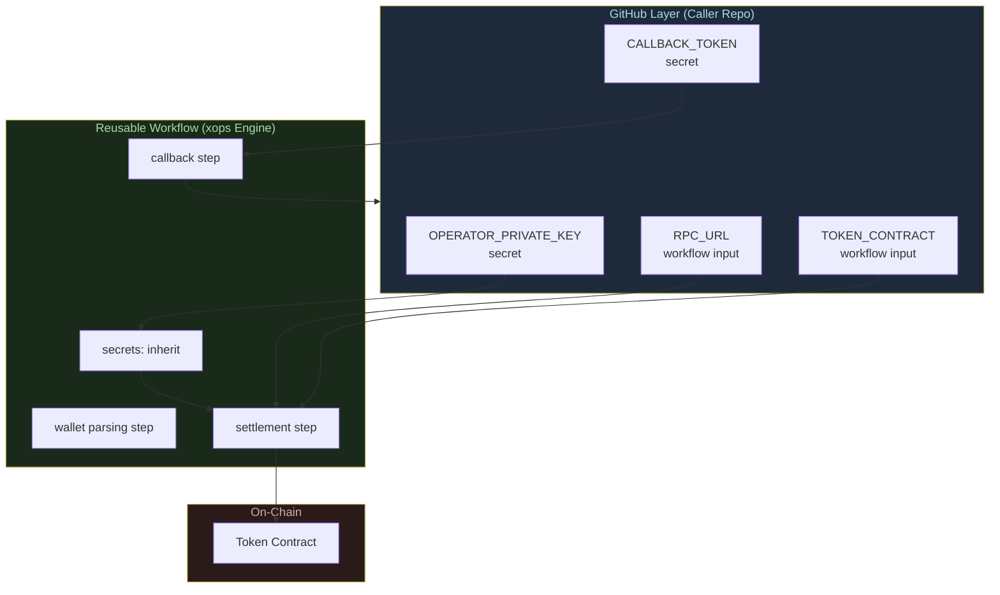
```mermaid
graph TD
  subgraph GitHub["GitHub Layer (Caller Repo)"]
    S1[OPERATOR_PRIVATE_KEY\nsecret]
    S2[CALLBACK_TOKEN\nsecret]
    S3[RPC_URL\nworkflow input]
    S4[TOKEN_CONTRACT\nworkflow input]
  end

  subgraph Engine["Reusable Workflow (xops Engine)"]
    E1[secrets: inherit]
    E2[wallet parsing step]
    E3[settlement step]
    E4[callback step]
  end

  subgraph Chain["On-Chain"]
    C1[Token Contract]
  end

  S1 --> E1 --> E3
  S2 --> E4
  S3 --> E3
  S4 --> E3
  E3 --> C1
  E4 --> GitHub

  style GitHub fill:#1e2a3a,color:#a8d8ea
  style Engine fill:#1a2a1a,color:#a8d8a8
  style Chain fill:#2a1a1a,color:#d8a8a8
```

### Internal: Test Matrix

| Scenario | Input | Expected Output |
|---|---|---|
| Valid wallet, valid amount | `0xabc...`, `100` | TX_HASH emitted, success comment posted |
| Invalid wallet format | `0xshort`, `100` | Failure comment: `INVALID_WALLET_FORMAT` |
| Non-maintainer trigger | comment from contributor | Failure comment: `PERMISSION_DENIED` |
| RPC unreachable | bad RPC_URL | Failure: `RPC_CONNECTION_ERROR` after 3 retries |
| Insufficient operator balance | valid params | Failure: `INSUFFICIENT_FUNDS` |
| Tx submitted but not confirmed (timeout) | valid params, slow chain | Warning comment: `PENDING_TIMEOUT` |
| Duplicate trigger on same PR | same trigger twice | Second run detects idempotency flag, skips |

Deliverables:

- Hardened execution pipeline with deterministic behavior.
- Ethers.js-based settlement module replacing Thirdweb.
- Stability checklist, runbook, and incident triage guide.
- Integration test matrix for caller + reusable workflows.
- Migration guide for users moving away from Thirdweb.

Exit Criteria:

- End-to-end settlement executes reliably using ethers.js only.
- Thirdweb is fully removed from codebase and documentation.
- Known failure cases are documented and reproducible.
- Callback outputs (`TX_HASH`, `EXPLORER_URL`) remain stable.
- System achieves consistent success rate across repeated runs.

**read in details in [phase2_architecture_shift.md](phase2_architecture_shift.md) for the technical approach and migration plan.**

## Phase 2: Treasury Contract Model (Pre-Funded Pool)

Goal:

- Support disbursement from a client-deployed treasury contract.
- Eliminate direct issuance-style flow in favor of transfer-from-pool pattern.

### What Treasury Contract Adds (That Direct Transfer Cannot)

A smart contract can enforce rules. Direct transfers cannot.

Treasury contract deployed by client can do:
- Limit per transaction
- Daily cap
- Pause system
- Revoke CI access
- Track disbursement history

Direct transfer cannot:
- No transaction limits
- No daily cap
- No pause capability
- No permission control layer

This control layer becomes critical when automating payouts at scale and across multiple contributors.

Scope:

**Important: The client deploys and owns the treasury contract. The execution engine only calls it.**

- Engine accepts `TREASURY_CONTRACT` address as input.
- Engine calls `disburse(recipient, amount)` (or similar client-defined interface).
- Client must deploy treasury contract with sufficient balance.
- Client enforces all governance and payout rules at the contract level.
- Add engine-level safeguards: balance checks, allowance verification, payout validation.

### Internal Flow: Direct Transfer vs Treasury Disbursement

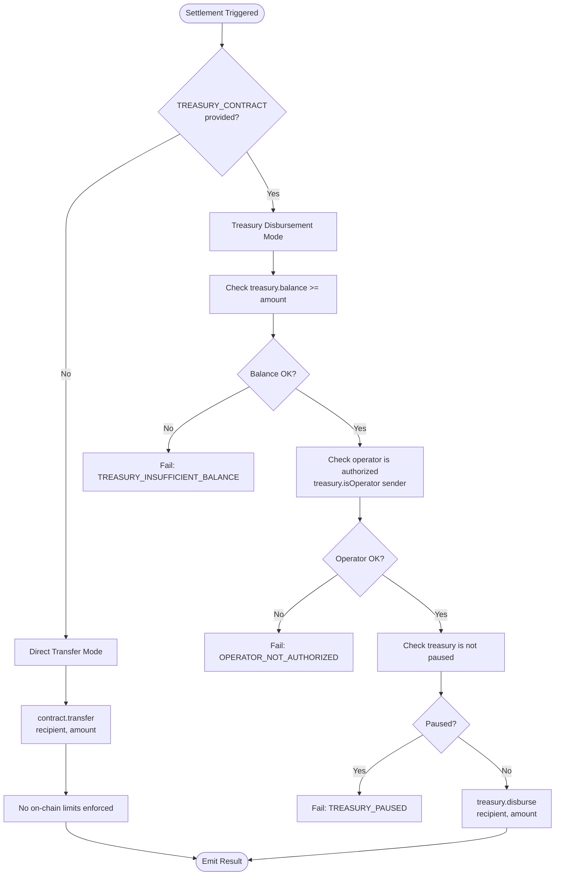
```mermaid
flowchart TD
  A([Settlement Triggered]) --> B{TREASURY_CONTRACT\nprovided?}

  B -- No --> C[Direct Transfer Mode]
  C --> C1[contract.transfer\nrecipient, amount]
  C1 --> C2[No on-chain limits enforced]
  C2 --> Z([Emit Result])

  B -- Yes --> D[Treasury Disbursement Mode]
  D --> D1[Check treasury.balance >= amount]
  D1 --> D2{Balance OK?}
  D2 -- No --> E[Fail: TREASURY_INSUFFICIENT_BALANCE]
  D2 -- Yes --> D3[Check operator is authorized\ntreasury.isOperator sender]
  D3 --> D4{Operator OK?}
  D4 -- No --> F[Fail: OPERATOR_NOT_AUTHORIZED]
  D4 -- Yes --> D5[Check treasury is not paused]
  D5 --> D6{Paused?}
  D6 -- Yes --> G[Fail: TREASURY_PAUSED]
  D6 -- No --> D7[treasury.disburse\nrecipient, amount]
  D7 --> Z
```

### Internal: Treasury Contract Interface (Minimum Required ABI)

The engine only needs to call these three functions. The client implements however they want, as long as these signatures match.

```solidity
// Minimum interface the engine calls against
interface IClientTreasury {
  // Called by engine before disbursement
  function isOperator(address operator) external view returns (bool);

  // Called by engine before disbursement
  function paused() external view returns (bool);

  // Main disbursement call
  function disburse(address recipient, uint256 amount) external returns (bool);

  // For pre-flight balance validation
  function availableBalance() external view returns (uint256);
}
```

### Internal: Engine Pre-Flight Checks Sequence

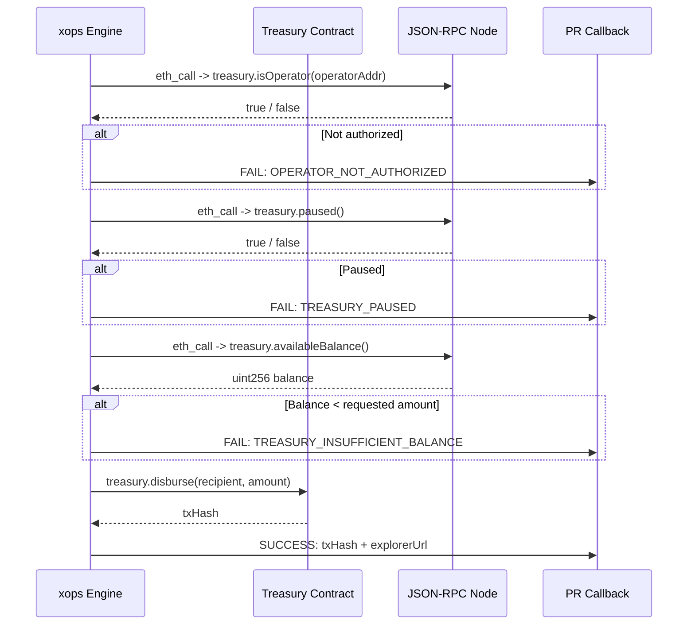
```mermaid
sequenceDiagram
  participant E as xops Engine
  participant T as Treasury Contract
  participant RPC as JSON-RPC Node
  participant PR as PR Callback

  E->>RPC: eth_call -> treasury.isOperator(operatorAddr)
  RPC-->>E: true / false
  alt Not authorized
    E->>PR: FAIL: OPERATOR_NOT_AUTHORIZED
  end

  E->>RPC: eth_call -> treasury.paused()
  RPC-->>E: true / false
  alt Paused
    E->>PR: FAIL: TREASURY_PAUSED
  end

  E->>RPC: eth_call -> treasury.availableBalance()
  RPC-->>E: uint256 balance
  alt Balance < requested amount
    E->>PR: FAIL: TREASURY_INSUFFICIENT_BALANCE
  end

  E->>T: treasury.disburse(recipient, amount)
  T-->>E: txHash
  E->>PR: SUCCESS: txHash + explorerUrl
```

### Internal: Mode Detection Logic

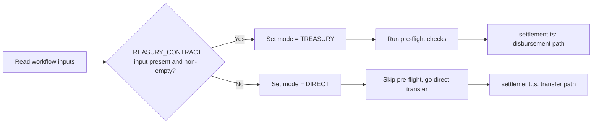
```mermaid
flowchart LR
  A[Read workflow inputs] --> B{TREASURY_CONTRACT\ninput present and non-empty?}
  B -- Yes --> C[Set mode = TREASURY]
  B -- No --> D[Set mode = DIRECT]
  C --> E[Run pre-flight checks]
  D --> F[Skip pre-flight, go direct transfer]
  E --> G[settlement.ts: disbursement path]
  F --> H[settlement.ts: transfer path]
```

Deliverables:

- Treasury contract specification and deployment guide.
- Reusable workflow updated for transfer/disbursement mode.
- Emergency pause and treasury refill SOP.

Exit criteria:

- Settlements execute without contract-specific privileged role dependency.
- Treasury accounting and audit trail are verifiable.

## Phase 3: Input-Driven Multi-Chain Execution

Goal:

- Execute against any EVM chain and multiple token contracts provided by the client.
- Remove all hardcoded chain IDs, RPC URLs, and contract addresses.

Scope:

**Important: The engine is input-driven, not network-selecting.**

- Engine accepts RPC URL, chain ID, explorer URL, and contract address as runtime inputs.
- Client chooses which chain and tokens to use via workflow inputs or config.
- Multi-token support routed entirely by client configuration per repo, label, or contribution type.
- Validation layer confirms provided chain/token configuration is safe, but does not select or manage it.

### Internal Flow: Chain Config Resolution

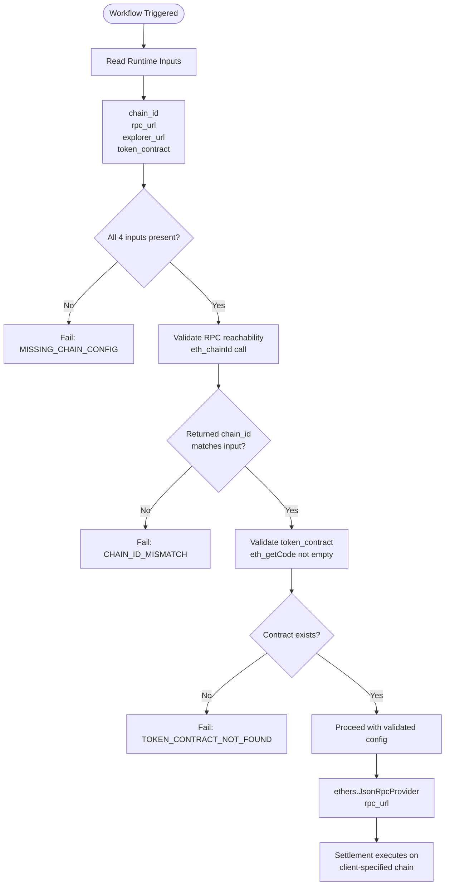
```mermaid
flowchart TD
  A([Workflow Triggered]) --> B[Read Runtime Inputs]
  B --> C[chain_id\nrpc_url\nexplorer_url\ntoken_contract]
  C --> D{All 4 inputs present?}
  D -- No --> E[Fail: MISSING_CHAIN_CONFIG]
  D -- Yes --> F[Validate RPC reachability\neth_chainId call]
  F --> G{Returned chain_id\nmatches input?}
  G -- No --> H[Fail: CHAIN_ID_MISMATCH]
  G -- Yes --> I[Validate token_contract\neth_getCode not empty]
  I --> J{Contract exists?}
  J -- No --> K[Fail: TOKEN_CONTRACT_NOT_FOUND]
  J -- Yes --> L[Proceed with validated config]
  L --> M[ethers.JsonRpcProvider\nrpc_url]
  M --> N[Settlement executes on\nclient-specified chain]
```

### Internal: Unified Chain Config Schema

```yaml
# How client passes config per workflow (example)
chain_config:
  chain_id: "10143"
  rpc_url: ${{ secrets.RPC_URL }}
  explorer_url: "https://testnet.monadexplorer.com"
  token_contract: ${{ secrets.TOKEN_CONTRACT }}
  decimals: 18
  symbol: "MON"
```

### Internal: Multi-Token Routing Map

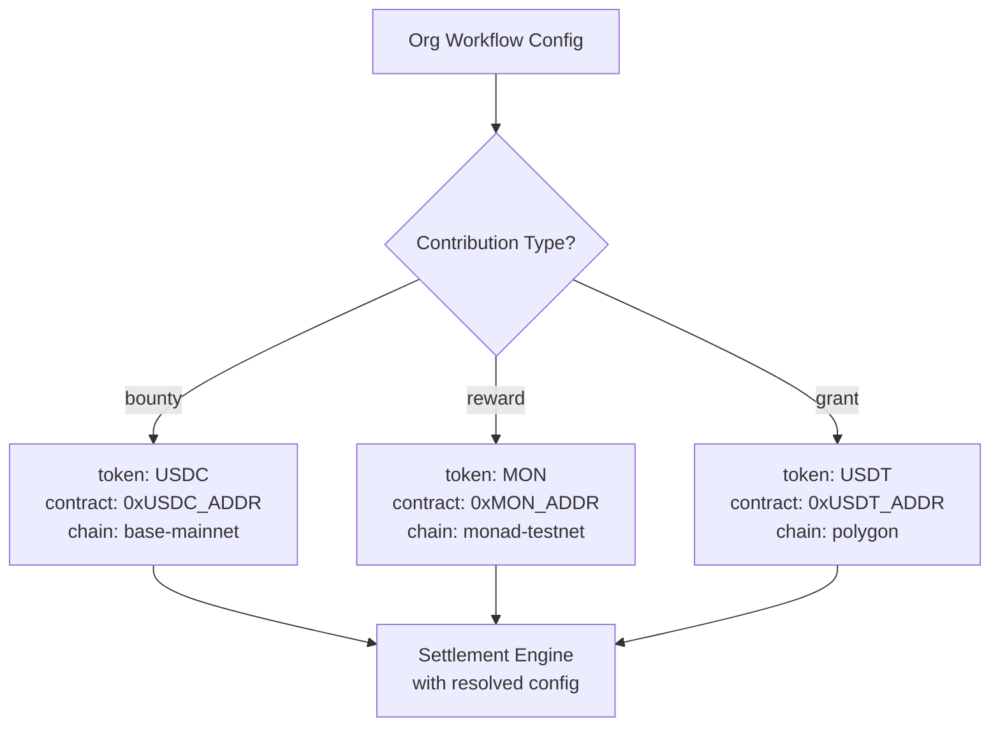
```mermaid
flowchart TD
  A[Org Workflow Config] --> B{Contribution Type?}
  B -- bounty --> C[token: USDC\ncontract: 0xUSDC_ADDR\nchain: base-mainnet]
  B -- reward --> D[token: MON\ncontract: 0xMON_ADDR\nchain: monad-testnet]
  B -- grant --> E[token: USDT\ncontract: 0xUSDT_ADDR\nchain: polygon]
  C --> F[Settlement Engine\nwith resolved config]
  D --> F
  E --> F
```

Deliverables:

- Unified chain config schema.
- Token routing policy map.
- Backward-compatible defaults for current Monad flows.

Exit criteria:

- Same reusable workflow runs on multiple EVM networks.
- Multiple token payouts supported in one org setup.

## Phase 4: x402 CI/CD Reusable Action + CLI + Chat UX

Goal:

- Provide a first-class reusable automation interface.

Scope:

- Publish reusable action style interface.
- Introduce CLI command:

```bash
xops pay --to wallet 0x... --amount 100 --chain monad
```

- Support GitHub comment/chat command style:

```text
/send 0x... 10usdc monad
```

- Keep simple action usage in workflows:

```yaml
- uses: xops/pay@v1
  with:
  recipient: ${{ steps.wallet.outputs.addr }}
  score_amount: ${{ fromJSON(needs.maintainer_send.outputs.score_amount) }}
  network: monad-testnet
  secrets: inherit
```

### Internal: Unified Payout Resolution Architecture

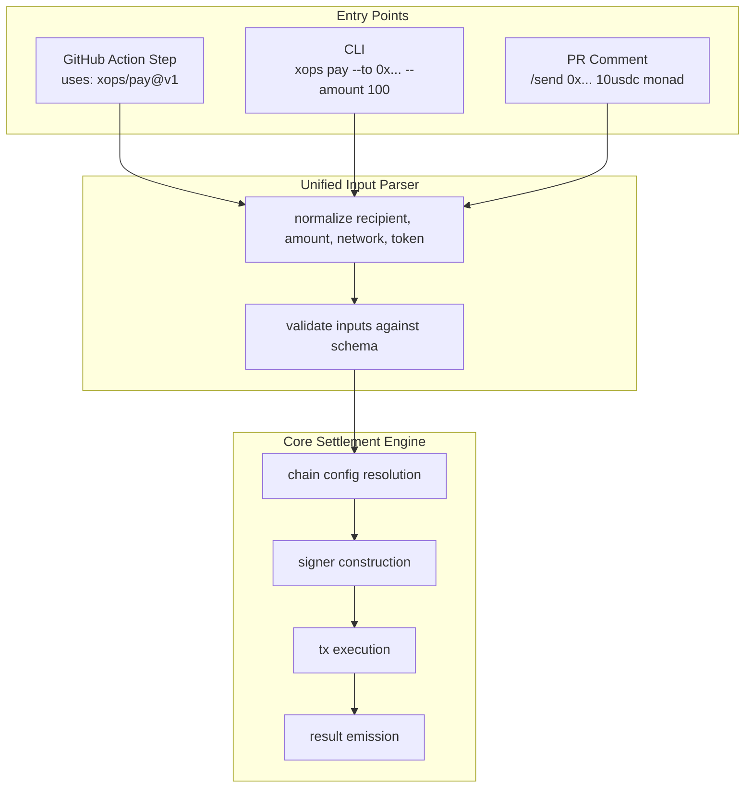
```mermaid
flowchart TD
  subgraph Inputs["Entry Points"]
    I1[GitHub Action Step\nuses: xops/pay@v1]
    I2[CLI\nxops pay --to 0x... --amount 100]
    I3[PR Comment\n/send 0x... 10usdc monad]
  end

  subgraph Parser["Unified Input Parser"]
    P1[normalize recipient, amount, network, token]
    P2[validate inputs against schema]
  end

  subgraph Engine["Core Settlement Engine"]
    E1[chain config resolution]
    E2[signer construction]
    E3[tx execution]
    E4[result emission]
  end

  I1 --> P1
  I2 --> P1
  I3 --> P1
  P1 --> P2 --> E1 --> E2 --> E3 --> E4
```

### Internal: Comment Command Parser Logic

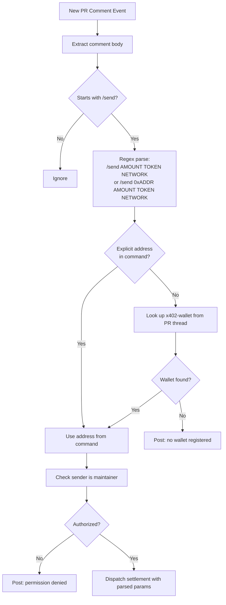
```mermaid
flowchart TD
  A[New PR Comment Event] --> B[Extract comment body]
  B --> C{Starts with /send?}
  C -- No --> D[Ignore]
  C -- Yes --> E[Regex parse:\n/send AMOUNT TOKEN NETWORK\nor /send 0xADDR AMOUNT TOKEN NETWORK]
  E --> F{Explicit address\nin command?}
  F -- Yes --> G[Use address from command]
  F -- No --> H[Look up x402-wallet from PR thread]
  H --> I{Wallet found?}
  I -- No --> J[Post: no wallet registered]
  I -- Yes --> G
  G --> K[Check sender is maintainer]
  K --> L{Authorized?}
  L -- No --> M[Post: permission denied]
  L -- Yes --> N[Dispatch settlement with parsed params]
```

### Internal: CLI -> Engine Bridge

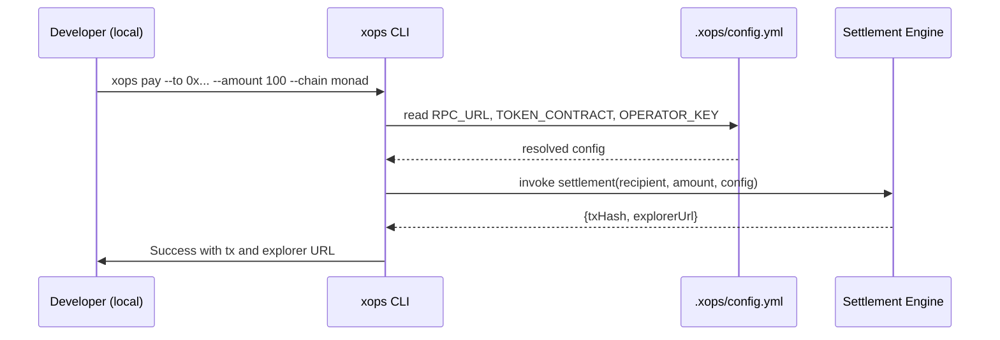
```mermaid
sequenceDiagram
  participant Dev as Developer (local)
  participant CLI as xops CLI
  participant Cfg as .xops/config.yml
  participant Engine as Settlement Engine

  Dev->>CLI: xops pay --to 0x... --amount 100 --chain monad
  CLI->>Cfg: read RPC_URL, TOKEN_CONTRACT, OPERATOR_KEY
  Cfg-->>CLI: resolved config
  CLI->>Engine: invoke settlement(recipient, amount, config)
  Engine-->>CLI: {txHash, explorerUrl}
  CLI->>Dev: Success with tx and explorer URL
```

Deliverables:

- `xops/pay@v1` reusable action/reusable workflow contract.
- CLI package and command docs.
- Command parser spec for GitHub comments.

Exit criteria:

- Teams can integrate payouts with one action step.
- CLI and comment command both resolve to the same payout engine.

## Phase 5: Declarative Policy Engine (Maintainer-Controlled Execution)

Goal:

Introduce a declarative policy engine that allows maintainers to define, modify, and enforce payout conditions directly within repository workflows, without changing execution logic.

This phase shifts control from hardcoded scripts to **maintainer-defined rules**, enabling flexible and consistent payout governance.

Scope:

Policies act as **pre-execution gates** evaluated before any transaction is sent.

Supported policy conditions include:

* PR merged status
* test workflow success
* maintainer approval or role-based authorization
* code coverage thresholds (e.g., > 80%)
* custom repository signals (labels, comments, statuses)

Policies are defined declaratively and can be combined.

### Internal: Policy Evaluation Flow

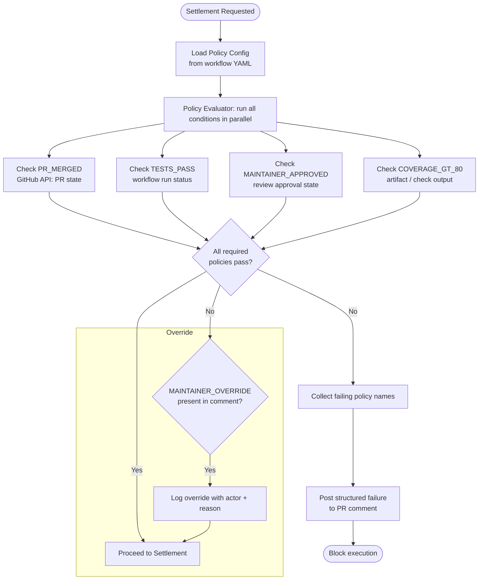
```mermaid
flowchart TD
  A([Settlement Requested]) --> B[Load Policy Config\nfrom workflow YAML]
  B --> C[Policy Evaluator: run all conditions in parallel]

  C --> D[Check PR_MERGED\nGitHub API: PR state]
  C --> E[Check TESTS_PASS\nworkflow run status]
  C --> F[Check MAINTAINER_APPROVED\nreview approval state]
  C --> G[Check COVERAGE_GT_80\nartifact / check output]

  D --> H{All required\npolicies pass?}
  E --> H
  F --> H
  G --> H

  H -- Yes --> I[Proceed to Settlement]
  H -- No --> J[Collect failing policy names]
  J --> K[Post structured failure\nto PR comment]
  K --> L([Block execution])

  subgraph Override
    M{MAINTAINER_OVERRIDE\npresent in comment?}
    M -- Yes --> N[Log override with actor + reason]
    N --> I
  end

  H -- No --> M
```

### Internal: Policy Condition Implementation Map

| Policy Constant | Implementation | GitHub API / Data Source |
|---|---|---|
| `PR_MERGED` | `pr.merged === true` | `GET /repos/{owner}/{repo}/pulls/{pull_number}` |
| `TESTS_PASS` | latest workflow run for `needs:` jobs = `success` | `GET /repos/{owner}/{repo}/actions/runs` |
| `MAINTAINER_APPROVED` | PR review from CODEOWNERS member with `APPROVED` state | `GET /repos/{owner}/{repo}/pulls/{pull_number}/reviews` |
| `COVERAGE_GT_80` | parse coverage from check run output or artifact | `GET /repos/{owner}/{repo}/check-runs` |
| `NO_OPEN_REQUESTED_CHANGES` | no review in `CHANGES_REQUESTED` state | same as reviews endpoint |

### Internal: Policy Result PR Comment Format

```text
| Policy            | Status  | Detail                          |
|-------------------|---------|---------------------------------|
| PR_MERGED         | PASS    | Merged at 2025-07-01T10:00Z     |
| TESTS_PASS        | PASS    | Run #4521 succeeded             |
| MAINTAINER_APPROVED | FAIL  | No approved review found        |
| COVERAGE_GT_80    | PASS    | Coverage: 84%                   |

Execution blocked. 1 policy failed: MAINTAINER_APPROVED
```

**Example Usage**

```yaml
- uses: xops/pay@v1
  needs: [test, review]
  with:
  recipient: ${{ steps.wallet.outputs.addr }}
  score_amount: ${{ fromJSON(needs.maintainer_send.outputs.score_amount) }}
  network: monad-testnet
  policy:
    require:
    - PR_MERGED
    - TESTS_PASS
    - MAINTAINER_APPROVED
    - COVERAGE_GT_80
  secrets: inherit
```

**Maintainer Flexibility Features**

* by default, all policies must pass for execution.
* Maintainers can:

  * add/remove rules per repository
  * override policies in controlled scenarios (e.g., emergency payout)
  * define different policies for different workflows (e.g., bounty vs reward)
* Supports progressive strictness (simple -> advanced governance)
* Supports failing, error classification, and actionable feedback for policy failures.

**Core Components**

1. **Policy DSL / Schema**

   * Standardized structure for defining rules
   * Extensible for future conditions

2. **Policy Evaluator (Runtime)**

   * Evaluates all policy conditions before execution
   * Produces deterministic pass/fail output

3. **Policy Result Layer**

   * Clear logs indicating which rules passed/failed
   * PR comment feedback for transparency

4. **Override Mechanism (Optional)**

   * Controlled bypass with explicit maintainer intent
   * Fully logged for auditability

Deliverables:

* Policy DSL/schema specification
* Policy evaluation module integrated into workflow runtime
* Maintainer documentation for configuration and overrides
* Structured logging and PR feedback for policy decisions

Exit Criteria:

* Payout execution is blocked unless all required policies pass
* Policy evaluation results are clearly visible in logs and PR comments
* Maintainers can modify policies without changing execution code
* Override actions (if used) are explicit and auditable

## Phase 6: Pre-Execution Simulation and Risk Validation

Goal:

- Introduce a dry-run execution layer that evaluates transactions before on-chain submission, providing deterministic feedback to maintainers and preventing avoidable failures.

Scope:

- The simulation layer runs after policy evaluation but before execution, acting as the final safety check.

Capabilities include:

- simulate contract call success/failure (using `eth_call`)
- estimate gas usage before execution
- detect contract-level constraint violations (e.g., treasury limits, paused state)
- validate balance, allowance, and operator permissions
- classify failure reasons deterministically

### Internal: Simulation Layer Position in Runtime

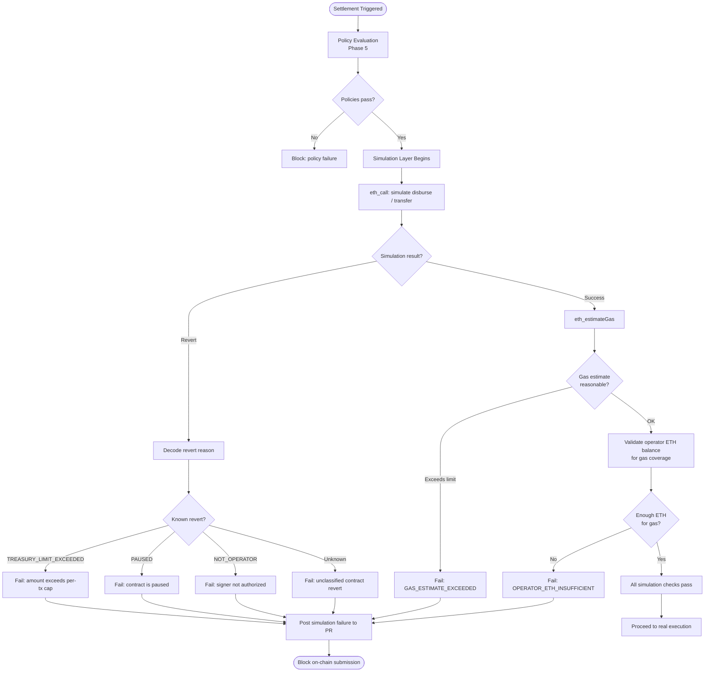
```mermaid
flowchart TD
  A([Settlement Triggered]) --> B[Policy Evaluation\nPhase 5]
  B --> C{Policies pass?}
  C -- No --> D[Block: policy failure]
  C -- Yes --> E[Simulation Layer Begins]

  E --> F[eth_call: simulate disburse / transfer]
  F --> G{Simulation result?}

  G -- Revert --> H[Decode revert reason]
  H --> I{Known revert?}
  I -- TREASURY_LIMIT_EXCEEDED --> J1[Fail: amount exceeds per-tx cap]
  I -- PAUSED --> J2[Fail: contract is paused]
  I -- NOT_OPERATOR --> J3[Fail: signer not authorized]
  I -- Unknown --> J4[Fail: unclassified contract revert]

  G -- Success --> K[eth_estimateGas]
  K --> L{Gas estimate\nreasonable?}
  L -- Exceeds limit --> M[Fail: GAS_ESTIMATE_EXCEEDED]
  L -- OK --> N[Validate operator ETH balance\nfor gas coverage]
  N --> O{Enough ETH\nfor gas?}
  O -- No --> P[Fail: OPERATOR_ETH_INSUFFICIENT]
  O -- Yes --> Q[All simulation checks pass]
  Q --> R[Proceed to real execution]

  J1 --> S[Post simulation failure to PR]
  J2 --> S
  J3 --> S
  J4 --> S
  M --> S
  P --> S
  S --> T([Block on-chain submission])
```

### Internal: Failure Taxonomy

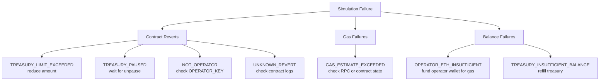
```mermaid
graph TD
  F[Simulation Failure] --> F1[Contract Reverts]
  F --> F2[Gas Failures]
  F --> F3[Balance Failures]

  F1 --> F1a[TREASURY_LIMIT_EXCEEDED\nreduce amount]
  F1 --> F1b[TREASURY_PAUSED\nwait for unpause]
  F1 --> F1c[NOT_OPERATOR\ncheck OPERATOR_KEY]
  F1 --> F1d[UNKNOWN_REVERT\ncheck contract logs]

  F2 --> F2a[GAS_ESTIMATE_EXCEEDED\ncheck RPC or contract state]

  F3 --> F3a[OPERATOR_ETH_INSUFFICIENT\nfund operator wallet for gas]
  F3 --> F3b[TREASURY_INSUFFICIENT_BALANCE\nrefill treasury]
```

Deliverables:

- Simulation module integrated into runtime flow
- Deterministic failure taxonomy for simulation results
- Maintainer-facing simulation output in logs and PR comments

Exit criteria:

- Transactions are simulated before execution in supported flows
- Simulation outputs include clear pass/fail reasons
- Known pre-execution failures are blocked before on-chain submission

## Phase 7: Multi-Contributor and Split Payouts

Goal:

- Support multiple recipients and different amounts in one PR context.

Scope:

- Parse and execute multiple `/send` lines safely.
- Recipient-explicit command support.
- Batch settlement with partial-failure reporting.

### Internal: Batch Parse and Execute Flow

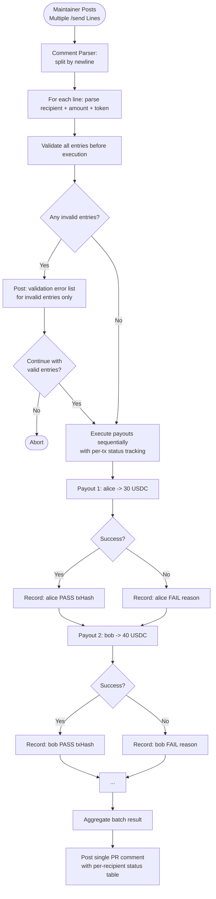
```mermaid
flowchart TD
  A([Maintainer Posts\nMultiple /send Lines]) --> B[Comment Parser:\nsplit by newline]
  B --> C[For each line: parse recipient + amount + token]
  C --> D[Validate all entries before execution]
  D --> E{Any invalid entries?}
  E -- Yes --> F[Post: validation error list\nfor invalid entries only]
  F --> G{Continue with\nvalid entries?}
  G -- No --> H([Abort])
  G -- Yes --> I

  E -- No --> I[Execute payouts sequentially\nwith per-tx status tracking]
  I --> J[Payout 1: alice -> 30 USDC]
  J --> K{Success?}
  K -- Yes --> L[Record: alice PASS txHash]
  K -- No --> M[Record: alice FAIL reason]

  L --> N[Payout 2: bob -> 40 USDC]
  M --> N
  N --> O{Success?}
  O -- Yes --> P[Record: bob PASS txHash]
  O -- No --> Q[Record: bob FAIL reason]

  P --> R[...]
  Q --> R

  R --> S[Aggregate batch result]
  S --> T[Post single PR comment\nwith per-recipient status table]
```

### Internal: Batch Result PR Comment Format

```text
## xops Batch Settlement

| Recipient | Amount | Status | Detail                                |
|-----------|--------|--------|---------------------------------------|
| @alice    | 30 USDC | PASS   | tx link                               |
| @bob      | 40 USDC | PASS   | tx link                               |
| @charlie  | 50 USDC | FAIL   | TREASURY_INSUFFICIENT_BALANCE         |

2/3 payouts succeeded. 1 failure requires manual resolution.
```

### Internal: Partial Failure Strategy

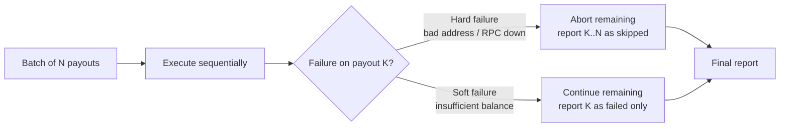
```mermaid
flowchart LR
  A[Batch of N payouts] --> B[Execute sequentially]
  B --> C{Failure on payout K?}
  C -- Hard failure\nbad address / RPC down --> D[Abort remaining\nreport K..N as skipped]
  C -- Soft failure\ninsufficient balance --> E[Continue remaining\nreport K as failed only]
  D --> F[Final report]
  E --> F
```

Example target usage:

```text
@alice /send 0x... 30 usdc monad
@bob /send 0x... 40 usdc monad
@charlie /send 0x... 50 usdc monad
```

Deliverables:

- Multi-recipient parser and validator.
- Batch payout execution strategy.
- Clear PR comment summary per recipient.

Exit criteria:

- One maintainer action can settle multiple contributors.
- Failures do not hide successful payouts.

## Phase 8: Web2 Settlement + Reputation Dashboard

Goal:

- Expand beyond crypto-native contributors and improve visibility.

Scope:

- Web2 settlement/offramp via x402 HTTP payments for non-crypto users.
- Reputation dashboard reading on-chain scores and showing org-level contributor views.

### Internal: Web2 Offramp Architecture

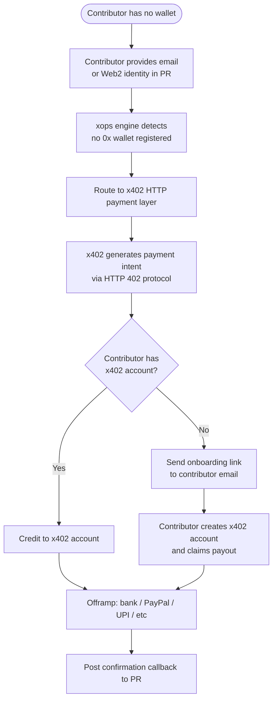
```mermaid
flowchart TD
  A([Contributor has no wallet]) --> B[Contributor provides email\nor Web2 identity in PR]
  B --> C[xops engine detects\nno 0x wallet registered]
  C --> D[Route to x402 HTTP payment layer]
  D --> E[x402 generates payment intent\nvia HTTP 402 protocol]
  E --> F{Contributor has\nx402 account?}
  F -- Yes --> G[Credit to x402 account]
  F -- No --> H[Send onboarding link\nto contributor email]
  H --> I[Contributor creates x402 account\nand claims payout]
  G --> J[Offramp: bank / PayPal / UPI / etc]
  I --> J
  J --> K[Post confirmation callback to PR]
```

### Internal: Reputation Dashboard Data Model

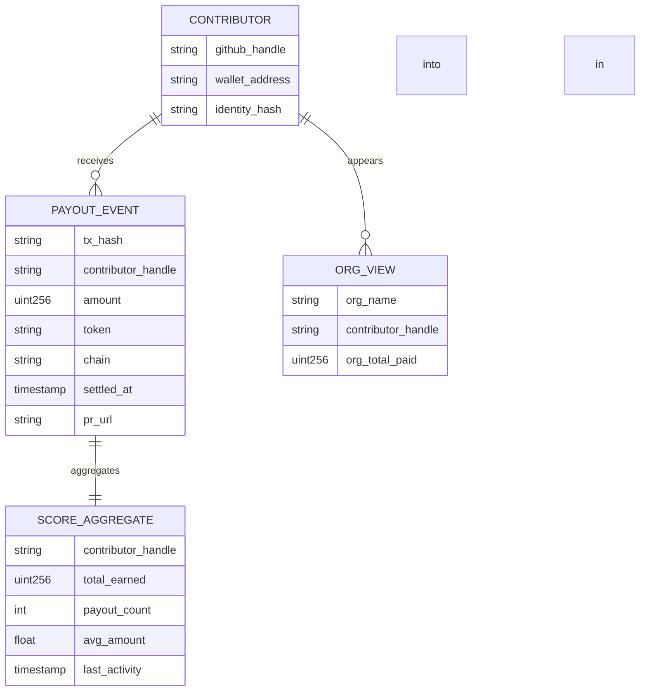
```mermaid
erDiagram
  CONTRIBUTOR {
    string github_handle
    string wallet_address
    string identity_hash
  }
  PAYOUT_EVENT {
    string tx_hash
    string contributor_handle
    uint256 amount
    string token
    string chain
    timestamp settled_at
    string pr_url
  }
  SCORE_AGGREGATE {
    string contributor_handle
    uint256 total_earned
    int payout_count
    float avg_amount
    timestamp last_activity
  }
  ORG_VIEW {
    string org_name
    string contributor_handle
    uint256 org_total_paid
  }

  CONTRIBUTOR ||--o{ PAYOUT_EVENT : receives
  PAYOUT_EVENT ||--|| SCORE_AGGREGATE : aggregates into
  CONTRIBUTOR ||--o{ ORG_VIEW : appears in
```

### Internal: Dashboard Service Architecture

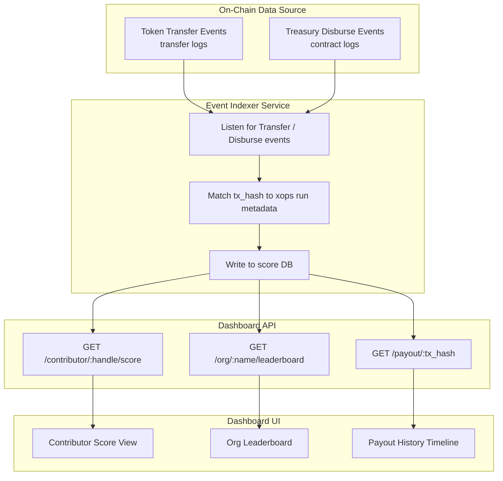
```mermaid
flowchart TD
  subgraph OnChain["On-Chain Data Source"]
    C1[Token Transfer Events\ntransfer logs]
    C2[Treasury Disburse Events\ncontract logs]
  end

  subgraph Indexer["Event Indexer Service"]
    I1[Listen for Transfer / Disburse events]
    I2[Match tx_hash to xops run metadata]
    I3[Write to score DB]
  end

  subgraph API["Dashboard API"]
    A1[GET /contributor/:handle/score]
    A2[GET /org/:name/leaderboard]
    A3[GET /payout/:tx_hash]
  end

  subgraph UI["Dashboard UI"]
    U1[Contributor Score View]
    U2[Org Leaderboard]
    U3[Payout History Timeline]
  end

  C1 --> I1
  C2 --> I1
  I1 --> I2 --> I3
  I3 --> A1
  I3 --> A2
  I3 --> A3
  A1 --> U1
  A2 --> U2
  A3 --> U3
```

Deliverables:

- Offramp integration architecture.
- Contributor identity mapping model.
- Dashboard service and UI MVP.

Exit criteria:

- Non-wallet contributors can receive value through Web2 rails.
- Org can view contributor score trends and payout history.

## some important links (must read for better understanding of the context and security implications)
- important article:[link](https://chainscorelabs.com/en/guides/developer-experience-dx-blockchain-tools-and-analytics/smart-contract-lifecycle/how-to-establish-a-secure-smart-contract-deployment-pipeline)
- for upto-date about x402: https://github.com/xpaysh/awesome-x402
- some important links for this : [link](links.md)
- x402 deep dive: https://www.youtube.com/live/lSdHKTmLArY?si=30I_K015jj8Ho529
- after all phase, security review for trust and safety: https://youtube.com/playlist?list=PL5d8mp75BVkTLJg1hfThfB7cHLVnfYjzZ&si=QFtvyRpRpOpuXdfE

## Appendix: Failure Classification

| Error Code | Phase | Cause | Resolution |
|---|---|---|---|
| `INVALID_WALLET_FORMAT` | 1 | Wallet not matching `0x[40 hex]` | Contributor re-posts wallet |
| `PERMISSION_DENIED` | 1 | Non-maintainer triggered `/send` | Only maintainers can trigger |
| `RPC_CONNECTION_ERROR` | 1 | RPC_URL unreachable | Check RPC_URL secret |
| `INSUFFICIENT_FUNDS` | 1 | Operator wallet has no token balance | Fund operator wallet |
| `PENDING_TIMEOUT` | 1 | Tx stuck in mempool | Check gas price, retry |
| `TREASURY_INSUFFICIENT_BALANCE` | 2 | Treasury balance < requested | Client refills treasury |
| `TREASURY_PAUSED` | 2 | Treasury in paused state | Client unpauses contract |
| `OPERATOR_NOT_AUTHORIZED` | 2 | Operator key not on treasury allowlist | Client authorizes operator |
| `CHAIN_ID_MISMATCH` | 3 | RPC reports different chain than config | Fix chain_id input |
| `TOKEN_CONTRACT_NOT_FOUND` | 3 | No code at token_contract address | Verify contract on explorer |
| `GAS_ESTIMATE_EXCEEDED` | 6 | Estimated gas above safety threshold | Check contract state |
| `OPERATOR_ETH_INSUFFICIENT` | 6 | Operator has no ETH for gas | Fund operator with gas ETH |
| `POLICY_FAILED` | 5 | One or more policy conditions not met | See policy evaluation output |
